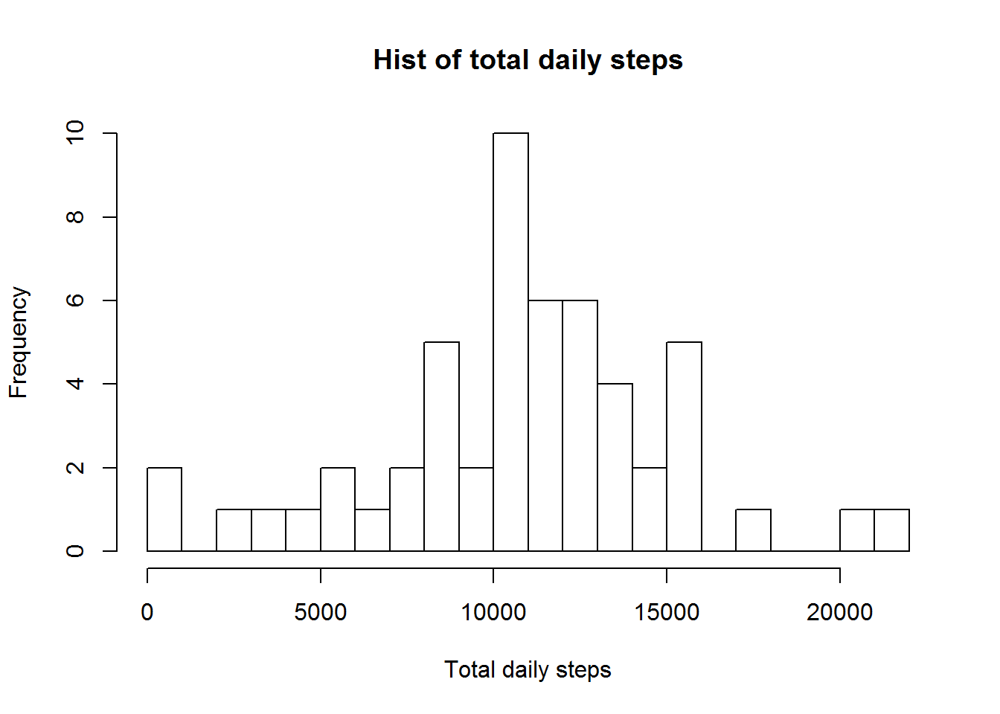
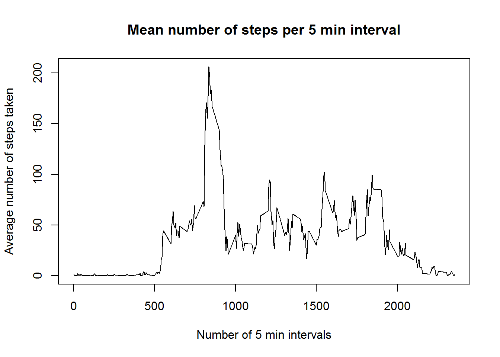
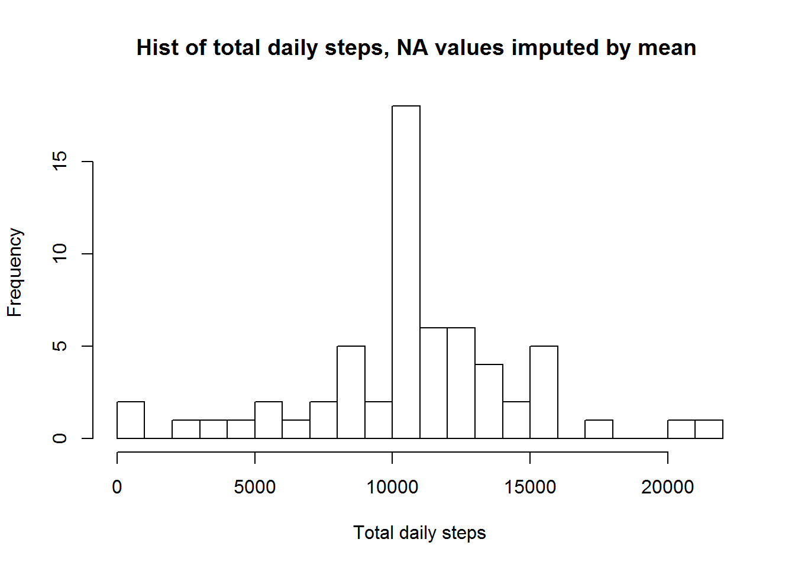
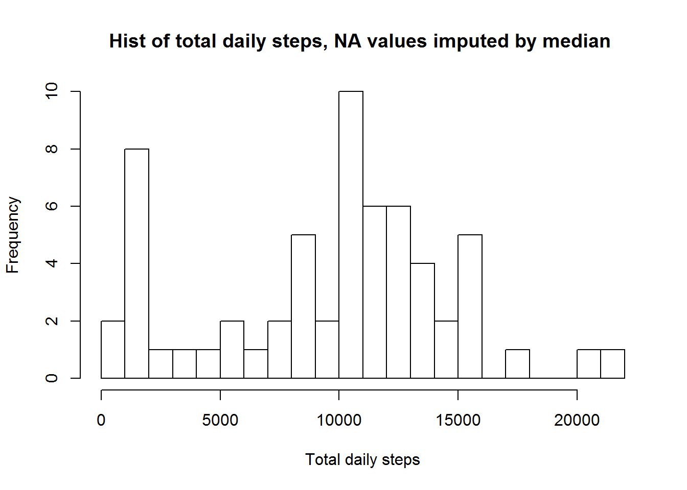
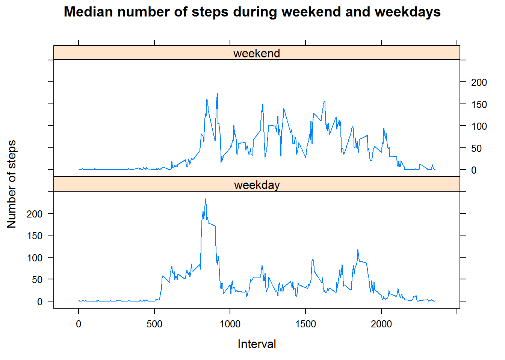

###Load the data :

```{r}
if(!file.exists("./activity.csv")){
                download.file("http://d396qusza40orc.cloudfront.net/repdata%2Fdata%2Factivity.zip","repdata-data-activity.zip")
                unzip("repdata-data-activity.zip")
                }
data <- read.csv("activity.csv",colClasses = c("numeric", "Date", "numeric"))
print("Loaded")
#head(data)
```

###What is mean total number of steps taken per day?
####1.Make a histogram of the total number of steps taken each day
```{r}
steps_per_day<- aggregate(steps ~ date, data, FUN=sum)

hist(steps_per_day$steps,breaks=20,main="Hist of total daily steps",xlab="Total daily steps")
```



####2.Calculate and report the mean and median total number of steps taken per day
The median is :
```{r}
median(steps_per_day$steps, na.rm=TRUE)
```
And the mean is
```{r}
mean(steps_per_day$steps, na.rm=TRUE)
```

###What is the average daily activity pattern?
#### 1.Make a time series plot (i.e. type = "l") of the 5-minute interval (x-axis) and the average number of steps taken, averaged across all days (y-axis)
```{r}
mean_steps_per_interval<- aggregate(steps ~ interval, data, FUN=mean)

plot(mean_steps_per_interval, type="l",main="Mean number of steps per 5 min interval",ylab="Average number of steps taken",xlab="Number of 5 min intervals")
```


#### 2.Which 5-minute interval, on average across all the days in the dataset, contains the maximum number of steps?

```{r}
mean_steps_per_interval$interval[which.max(mean_steps_per_interval$steps)]
```

### Imputing missing values
#### 1.Calculate and report the total number of missing values in the dataset (i.e. the total number of rows with NAs)

```{r}
sum(is.na(data))
```

#### 2.Devise a strategy for filling in all of the missing values in the dataset. The strategy does not need to be sophisticated.

I'd fill the missing values by median of number of steps taken for this interval during all days .
Another option is to use the mean of number of steps taken for this interval during all days instead.

#### 3.Create a new dataset that is equal to the original dataset but with the missing data filled in.

```{r}
mean_steps_per_interval <- aggregate(steps ~ interval, data, FUN=mean, na.rm = TRUE)
median_steps_per_interval <- aggregate(steps ~ interval, data, FUN=median, na.rm = TRUE)
nas <- is.na(data$steps)
fulldata<-cbind(data,imputed_mean=data$steps,imputed_median=data$steps)
for (i in 1:nrow(fulldata)) {
  if (is.na(fulldata[i,]$steps))
  {     
        mean_steps<-mean_steps_per_interval$steps[which(mean_steps_per_interval$interva==fulldata[i,]$interval)]
        median_steps<-median_steps_per_interval$steps[which(median_steps_per_interval$interva==fulldata[i,]$interval)]
        fulldata[i,]$imputed_mean <- round(mean_steps,digits=0)
        fulldata[i,]$imputed_median <- median_steps
  }
}
```

#### 4.Make a histogram of the total number of steps taken each day and Calculate and report the mean and median total number of steps taken per day. Do these values differ from the estimates from the first part of the assignment? What is the impact of imputing missing data on the estimates of the total daily number of steps?

##### Using mean imputed NA values
```{r}
imp_steps_per_day<- aggregate(imputed_mean ~ date, fulldata, FUN=sum)
hist(imp_steps_per_day$imputed_mean,breaks=20,main="Hist of total daily steps, NA values imputed by mean ",xlab="Total daily steps")
median(imp_steps_per_day$imputed_mean)
mean(imp_steps_per_day$imputed_mean)
```


Difference between original and imputed :
```{r}
median(steps_per_day$steps, na.rm=TRUE) - median(imp_steps_per_day$imputed_mean)
mean(steps_per_day$steps, na.rm=TRUE) - mean(imp_steps_per_day$imputed_mean)
```


##### Using median imputed NA values
```{r}
imp_steps_per_day<- aggregate(imputed_median ~ date, fulldata, FUN=sum)
hist(imp_steps_per_day$imputed_median,breaks=20,main="Hist of total daily steps, NA values imputed by median ",xlab="Total daily steps")
median(imp_steps_per_day$imputed_median)
mean(imp_steps_per_day$imputed_median)
```


Difference between original and imputed :
```{r}
median(steps_per_day$steps, na.rm=TRUE) - median(imp_steps_per_day$imputed_median)
mean(steps_per_day$steps, na.rm=TRUE) - mean(imp_steps_per_day$imputed_median)
```

So we can see that imputing NA values by mean (in our case) keeps the data close to original results , while imputing by median causes major differences.

### Are there differences in activity patterns between weekdays and weekends?

#### 1. Create a new factor variable in the dataset with two levels -- "weekday" and "weekend" indicating whether a given date is a weekday or weekend day
```{r}
get_day_type <- function(date) {
  type <- "weekday"
  if (weekdays(as.Date(date)) %in% c("Saturday", "Sunday"))  
    type<- "weekend"
  type
  
}
fulldata$day_type <- as.factor(sapply(fulldata$date, get_day_type))

data_by_day_type<- aggregate(steps ~ day_type  + interval , fulldata, FUN=mean)

```


#### 2. Make a panel plot containing a time series plot (i.e. type = "l") of the 5-minute interval (x-axis) and the average number of steps taken, averaged across all weekday days or weekend days (y-axis)

```{r}
library(lattice)

xyplot(data_by_day_type$steps ~ data_by_day_type$interval | data_by_day_type$day_type,type = "l", layout = c(1, 2), main="Median number of steps during weekend and weekdays", xlab = "Interval", ylab = "Number of steps")
```

